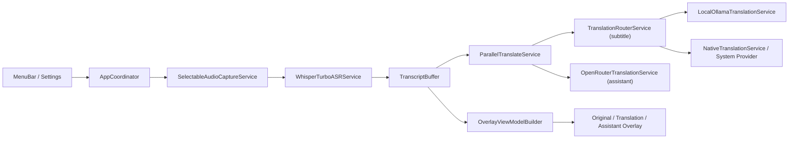

# Speechflow

Speechflow is a macOS menu bar real-time subtitle tool with microphone/system-audio input, local ASR, incremental translation, and overlay subtitles.

Language: [English](README.en.md) | [中文](README.zh-CN.md)

AI Agent install & deployment runbook: [English](Docs/AI_AGENT_README.en.md) | [中文](Docs/AI_AGENT_README.zh-CN.md)

## Features

- Menu bar workflow: `Start / Pause / Resume / Stop` session controls
- Dual input sources: microphone and system audio (only one active at a time)
- Local ASR with primary/fallback pipeline:
  - Primary: `WhisperTurboASRService` (Python runner + Qwen ASR)
  - Fallback: `SpeechFrameworkASRService`
- Incremental commit strategy: `partial` + `silence/stable/final` triggers to reduce long-sentence latency
- Translation routing:
  - Subtitle translation prefers local Ollama by default (switchable to system backend)
  - If local translation fails, it falls back to the system provider for that request
- Parallel cloud assistant stream: OpenRouter runs alongside subtitle translation
- Overlay rendering: separate windows for original / translated / assistant text
- Persistent settings: `UserDefaultsSettingsStore` stores font, color, language, backend preference, etc.

## Architecture

### Modules

- `SpeechflowApp`: menu bar UI, settings, three overlay windows, app entrypoint
- `SpeechflowCore`: state machine, ASR/translation services, shared models/protocols, render model
- `LocalTranslationBench`: CLI benchmark for local translation latency

### Runtime Data Flow



## Project Layout

```text
Speechflow/
├── Sources/
│   ├── SpeechflowApp/          # macOS menu bar app and overlays
│   ├── SpeechflowCore/         # core state machine and services
│   └── LocalTranslationBench/  # local translation benchmark
├── Scripts/
│   ├── build_dev_app_bundle.sh
│   ├── install_dev_dependencies.sh
│   └── run_local_translation_bench.sh
├── Docs/
│   ├── AI_AGENT_README.md
│   ├── DEPENDENCIES.md
│   ├── INTERFACES.md
│   └── TROUBLESHOOTING.md
└── Package.swift
```

## Requirements

- macOS 15+
- Swift 6.2 (see `Package.swift`)
- Python 3 (for local ASR runner)
- Ollama (for local subtitle translation)
- Optional: OpenRouter API key (assistant stream)

> The repo currently has no Python lockfile; see `Docs/DEPENDENCIES.md`.

## Usage

### 0) One-Command Dependency Bootstrap (recommended for first run)

```bash
./Scripts/install_dev_dependencies.sh
```

Optional flags:

- Skip Python deps: `./Scripts/install_dev_dependencies.sh --no-python-deps`
- Skip model pull: `./Scripts/install_dev_dependencies.sh --no-ollama-model-pull`
- Pull multiple models:
  `SPEECHFLOW_BOOTSTRAP_OLLAMA_MODELS="qwen3.5:0.8b,qwen3.5:2b" ./Scripts/install_dev_dependencies.sh`

### 0.1) Manual qwen-ASR Install (without bootstrap script)

```bash
python3 -m venv .venv
source .venv/bin/activate
python -m pip install --upgrade pip setuptools wheel
python -m pip install --upgrade qwen-asr faster-whisper
python -c "import qwen_asr, faster_whisper; print('qwen-asr ok')"
export SPEECHFLOW_FASTER_WHISPER_PYTHON_PATH="$(pwd)/.venv/bin/python"
```

If you do not use `.venv`, install into your existing Python environment and make sure `SPEECHFLOW_FASTER_WHISPER_PYTHON_PATH` points to the Python executable where `qwen-asr` is installed.

### 1) Build

```bash
swift build
```

### 2) Recommended Launch Path (best for permissions)

```bash
./Scripts/build_dev_app_bundle.sh
open dist/Speechflow.app
```

Note: for first-time permission checks, launch `dist/Speechflow.app`. Raw `swift run` binaries can behave poorly with macOS TCC permission prompts.

### 3) Menu Bar Controls

- `Translate Microphone`: start microphone input
- `Translate System Audio`: start system-audio input
- `Pause / Resume / Stop`: session control
- `Enable Translation / Show Overlay`: quick toggles
- `Preferences...`: settings window (language, ASR tuning, backend preference, OpenRouter key, style)

### 4) Local Translation Benchmark

```bash
./Scripts/run_local_translation_bench.sh
```

## Deployment

### Option A: Local Dev/Test Deployment (recommended)

1. Install dependencies on target machine (`Python3`, `Ollama`)
2. Run `./Scripts/build_dev_app_bundle.sh`
3. Distribute and launch `dist/Speechflow.app`

### Option B: Team Distribution (pre-production)

Current repo script is for development packaging (with optional ad-hoc `codesign`). For external distribution, add the following in CI/CD:

1. Pinned Swift/Xcode toolchain
2. Developer ID signing
3. Apple notarization
4. Artifact verification and versioned release

## Key Environment Variables

### ASR

- `SPEECHFLOW_FASTER_WHISPER_PYTHON_PATH`
- `SPEECHFLOW_ASR_MODEL` / `SPEECHFLOW_FASTER_WHISPER_MODEL`
- `SPEECHFLOW_ASR_MODEL_PATH`
- `SPEECHFLOW_ASR_DOWNLOAD_ROOT`

Default ASR model: `Qwen/Qwen3-ASR-1.7B`

### Local Translation (Ollama)

- `SPEECHFLOW_OLLAMA_BASE_URL` (default: `http://127.0.0.1:11434`)
- `SPEECHFLOW_OLLAMA_MODEL` (default: `qwen3.5:0.8b`)
- `SPEECHFLOW_OLLAMA_TIMEOUT_SECONDS`
- `SPEECHFLOW_OLLAMA_MAX_TOKENS`
- `SPEECHFLOW_OLLAMA_THINK`

### OpenRouter (assistant stream)

- `SPEECHFLOW_OPENROUTER_API_KEY` / `OPENROUTER_API_KEY`
- `SPEECHFLOW_OPENROUTER_BASE_URL`
- `SPEECHFLOW_OPENROUTER_MODEL`

You can also configure the OpenRouter API key in the settings UI.

## Logs and Troubleshooting

- Runtime log: `log stream --predicate 'subsystem=="com.speechflow.core"'`
- Transcript output: `~/Documents/Speechflow_Transcript.txt`
- Troubleshooting guide: `Docs/TROUBLESHOOTING.md`

## Additional Docs

- AI Agent Runbook (language selector): `Docs/AI_AGENT_README.md`
- Interfaces and contracts: `Docs/INTERFACES.md`
- Dependency inventory: `Docs/DEPENDENCIES.md`
- Development status and milestones: `MVP_DEVELOPMENT_PLAN.md`
