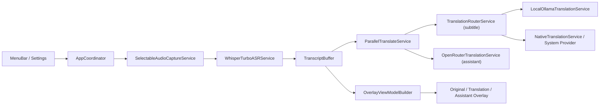

# Speechflow

Speechflow 是一个面向 macOS 的菜单栏实时字幕工具，支持麦克风/系统音频输入、本地语音识别、增量翻译和悬浮字幕显示。

语言 / Language: [中文](README.zh-CN.md) | [English](README.en.md)

AI Agent 安装与部署手册：[中文](Docs/AI_AGENT_README.zh-CN.md) | [English](Docs/AI_AGENT_README.en.md)

## 功能特性

- 菜单栏常驻：`Start / Pause / Resume / Stop` 控制翻译会话
- 双输入源：麦克风输入、系统音频输入（二选一激活）
- 本地 ASR 主备链路：
  - 主链路：`WhisperTurboASRService`（Python runner + Qwen ASR）
  - 备链路：`SpeechFrameworkASRService`
- 增量提交策略：`partial` + `silence/stable/final` 三类提交触发，降低长句延迟
- 翻译路由：
  - 字幕翻译默认优先本地 Ollama（可切到系统翻译）
  - 本地翻译失败时自动回退到系统翻译（当本次请求走的是本地路由）
- 云端助手并行流：OpenRouter（问题识别与建议回复）与字幕翻译并行执行
- 悬浮窗显示：原文 / 译文 / 助手 三个独立浮窗
- 设置持久化：`UserDefaultsSettingsStore` 保存字体、颜色、语言、后端偏好等

## 功能架构

### 分层模块

- `SpeechflowApp`：菜单栏 UI、设置页、3 个 Overlay 窗口、生命周期入口
- `SpeechflowCore`：状态机、识别/翻译服务、模型与协议、渲染模型
- `LocalTranslationBench`：本地翻译性能基准 CLI

### 数据流（运行时）



## 项目结构

```text
Speechflow/
├── Sources/
│   ├── SpeechflowApp/          # macOS 菜单栏应用与浮窗
│   ├── SpeechflowCore/         # 核心状态机与服务实现
│   └── LocalTranslationBench/  # 本地翻译性能测试
├── Scripts/
│   ├── build_dev_app_bundle.sh
│   ├── install_dev_dependencies.sh
│   └── run_local_translation_bench.sh
├── Docs/
│   ├── DEPENDENCIES.md
│   ├── INTERFACES.md
│   └── TROUBLESHOOTING.md
└── Package.swift
```

## 环境要求

- macOS 15+
- Swift 6.2（见 `Package.swift`）
- Python 3（本地 ASR runner 依赖）
- Ollama（本地字幕翻译）
- 可选：OpenRouter API Key（助手流）

> 当前仓库未提供 Python lockfile；详见 `Docs/DEPENDENCIES.md`。

## 使用方式

### 0) 一键安装依赖（推荐首次执行）

```bash
./Scripts/install_dev_dependencies.sh
```

可选：

- 跳过 Python 依赖：`./Scripts/install_dev_dependencies.sh --no-python-deps`
- 跳过模型拉取：`./Scripts/install_dev_dependencies.sh --no-ollama-model-pull`
- 指定拉取多个模型：
  `SPEECHFLOW_BOOTSTRAP_OLLAMA_MODELS="qwen3.5:0.8b,qwen3.5:2b" ./Scripts/install_dev_dependencies.sh`

### 0.1) 手动安装 qwen-ASR（不使用脚本）

```bash
python3 -m venv .venv
source .venv/bin/activate
python -m pip install --upgrade pip setuptools wheel
python -m pip install --upgrade qwen-asr faster-whisper
python -c "import qwen_asr, faster_whisper; print('qwen-asr ok')"
export SPEECHFLOW_FASTER_WHISPER_PYTHON_PATH="$(pwd)/.venv/bin/python"
```

如果你不用 `.venv`，也可以装到现有 Python 环境；但需要确保 `SPEECHFLOW_FASTER_WHISPER_PYTHON_PATH` 指向安装了 `qwen-asr` 的 Python 可执行文件。

### 1) 构建

```bash
swift build
```

### 2) 推荐启动（权限最稳定）

```bash
./Scripts/build_dev_app_bundle.sh
open dist/Speechflow.app
```

说明：首次权限授权建议从 `dist/Speechflow.app` 启动。直接 `swift run` 的裸可执行进程在 macOS TCC 场景下可能无法正常触发权限流程。

### 3) 菜单栏操作

- `Translate Microphone`：启动麦克风输入
- `Translate System Audio`：启动系统音频输入
- `Pause / Resume / Stop`：控制会话状态
- `Enable Translation / Show Overlay`：快速开关
- `Preferences...`：打开设置页（语言、识别调优、翻译后端、OpenRouter Key、样式）

### 4) 本地翻译基准测试

```bash
./Scripts/run_local_translation_bench.sh
```

## 部署方式

### 方式 A：本机开发/测试部署（推荐）

1. 在目标机器安装依赖（Python3、Ollama）
2. 执行 `./Scripts/build_dev_app_bundle.sh`
3. 分发并启动 `dist/Speechflow.app`

### 方式 B：团队分发部署（生产前）

当前仓库内置的是开发打包脚本（含可选 ad-hoc `codesign`）。若要对外分发，建议在 CI/CD 增加：

1. 固定 Swift/Xcode 构建环境
2. Developer ID 签名
3. Apple notarization
4. 产物校验与版本化发布

## 关键配置（环境变量）

### ASR

- `SPEECHFLOW_FASTER_WHISPER_PYTHON_PATH`
- `SPEECHFLOW_ASR_MODEL` / `SPEECHFLOW_FASTER_WHISPER_MODEL`
- `SPEECHFLOW_ASR_MODEL_PATH`
- `SPEECHFLOW_ASR_DOWNLOAD_ROOT`

默认 ASR 模型：`Qwen/Qwen3-ASR-1.7B`

### 本地翻译（Ollama）

- `SPEECHFLOW_OLLAMA_BASE_URL`（默认 `http://127.0.0.1:11434`）
- `SPEECHFLOW_OLLAMA_MODEL`（默认 `qwen3.5:0.8b`）
- `SPEECHFLOW_OLLAMA_TIMEOUT_SECONDS`
- `SPEECHFLOW_OLLAMA_MAX_TOKENS`
- `SPEECHFLOW_OLLAMA_THINK`

### OpenRouter（助手流）

- `SPEECHFLOW_OPENROUTER_API_KEY` / `OPENROUTER_API_KEY`
- `SPEECHFLOW_OPENROUTER_BASE_URL`
- `SPEECHFLOW_OPENROUTER_MODEL`

也可在设置页直接填写 OpenRouter API Key。

## 日志与排障

- 运行日志：`log stream --predicate 'subsystem=="com.speechflow.core"'`
- 字幕文本落盘：`~/Documents/Speechflow_Transcript.txt`
- 详细排障：`Docs/TROUBLESHOOTING.md`

## 补充文档

- AI Agent Runbook（语言入口）：`Docs/AI_AGENT_README.md`
- 接口契约：`Docs/INTERFACES.md`
- 依赖清单：`Docs/DEPENDENCIES.md`
- 开发现状与里程碑：`MVP_DEVELOPMENT_PLAN.md`
